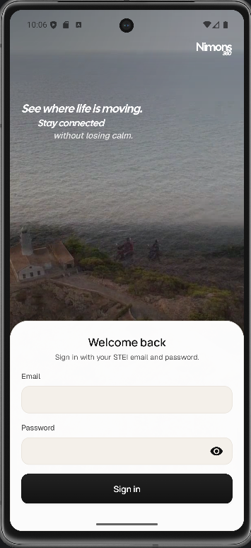

# NIMONS360

## Deskripsi
NIMONS360 adalah aplikasi Android untuk memantau lokasi dan status anggota keluarga secara real-time, mengelola keluarga, serta menyimpan lokasi favorit. Aplikasi ini mengintegrasikan REST API, WebSocket, penyimpanan lokal, GPS, dan sensor perangkat untuk mendukung pengalaman tracking yang responsif di perangkat Android.

## Cara Setup App

### Requirements
- Android Studio
- JDK 11
- Android SDK 35
- Emulator atau device Android minimal API 30
- Koneksi internet aktif
- GPS atau location service aktif

### Langkah Menjalankan

1. Clone repository dan masuk ke direktori project.

```bash
git clone https://github.com/Labpro-22/ms1-k02-ege.git
cd ms1-k02-ege
```

2. Buka root project di Android Studio, lalu pastikan environment Android sesuai dengan konfigurasi project

3. Jalankan `Gradle Sync` hingga seluruh dependency berhasil ter-resolve tanpa error.

4. Verifikasi bahwa project dapat dibangun dengan sukses melalui Gradle Wrapper.

```bash
./gradlew clean
./gradlew assembleDebug
```

5. Jika diperlukan, jalankan unit test untuk memastikan logika dasar aplikasi berjalan sesuai harapan.

```bash
./gradlew test
```

6. Hubungkan emulator atau physical device dengan Android 11 ke atas, lalu install build debug ke perangkat.

```bash
./gradlew installDebug
```

7. Alternatifnya, aplikasi dapat dijalankan langsung dari Android Studio menggunakan konfigurasi `app`.

8. Saat aplikasi pertama kali dijalankan, lakukan autentikasi menggunakan kredensial berikut:
   - Email: `{NIM}@std.stei.itb.ac.id`
   - Password: `{NIM}`

9. Berikan izin lokasi ketika diminta agar fitur peta, pelacakan posisi, dan sinkronisasi presence dapat berjalan dengan benar.

## Library yang Digunakan
- Kotlin
- Jetpack Compose
- Material 3
- AndroidX Navigation
- ViewModel, Lifecycle
- Room
- DataStore
- Retrofit
- OkHttp
- Kotlinx Serialization
- Kotlin Coroutines
- osmdroid
- Coil
- Media3

## Command
```bash
./gradlew clean
./gradlew assembleDebug
./gradlew installDebug
./gradlew build
./gradlew test
```

## Screenshot
Simpan screenshot aplikasi di folder `screenshot/`.

### Splash
- Menampilkan splash screen saat aplikasi dibuka sebagai transisi awal ke login atau home.

[SS Halaman Splash]

### Login
- Menampilkan form autentikasi dengan input email dan password.
- Setelah login berhasil, pengguna diarahkan ke halaman `Home`.



### Home
- Menampilkan daftar `My Families` dan `Discover Families`.
- Terdapat avatar menuju `Profile` dan tombol `+` menuju `Create Family`.

[SS Halaman Home]

### Families
- Menampilkan daftar seluruh family dengan fitur search, filter, dan pin lokal.
- Terdapat akses ke `Profile` dan `Create Family`.

[SS Halaman Families]

### Create Family
- Menampilkan form pembuatan family dengan input nama dan pemilihan icon.
- Setelah berhasil dibuat, pengguna diarahkan ke halaman detail family.

[SS Halaman Create Family]

### Family Detail
- Menampilkan detail family, daftar anggota, family code, serta aksi `Join` atau `Leave`.
- Family code dapat disalin jika pengguna sudah tergabung dalam family.

[SS Halaman Family Detail]

### Map
- Menampilkan peta interaktif, posisi pengguna, posisi anggota family lain, dan favorite location.
- Tersedia filter family, kontrol zoom, detail member, dan integrasi lokasi realtime.

[SS Halaman Map]

### Profile
- Menampilkan avatar, nama, email, serta fitur edit nama dan sign out.

[SS Halaman Profile]

## Pembagian Kerja
| Anggota | NIM | Tugas |
|---|---|---|
| Nama Anggota 1 | 135231xx | Placeholder, auth, struktur proyek |
| Nama Anggota 2 | 13523xx | Placeholder, fitur keluarga, integrasi API |
| Nama Anggota 3 | 13523xx | Placeholder, fitur peta, live tracking |

## Jam Persiapan dan Pengerjaan
| Anggota | Jam Persiapan | Jam Pengerjaan |
|---|---:|---:|
| Nama Anggota 1 | 0 jam | 0 jam |
| Nama Anggota 2 | 0 jam | 0 jam |
| Nama Anggota 3 | 0 jam | 0 jam |
