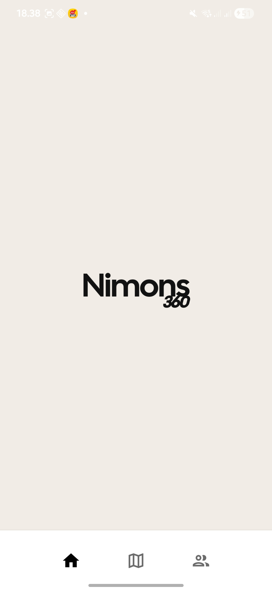
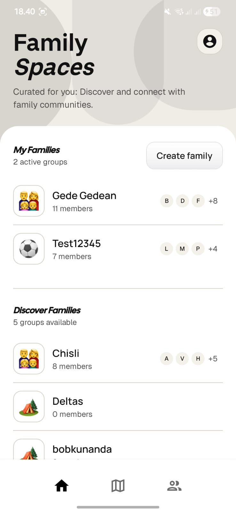
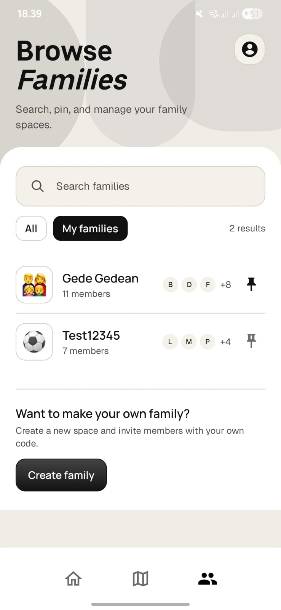
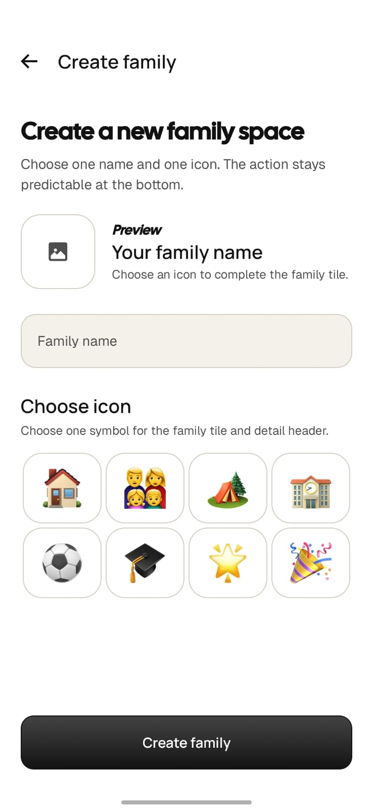
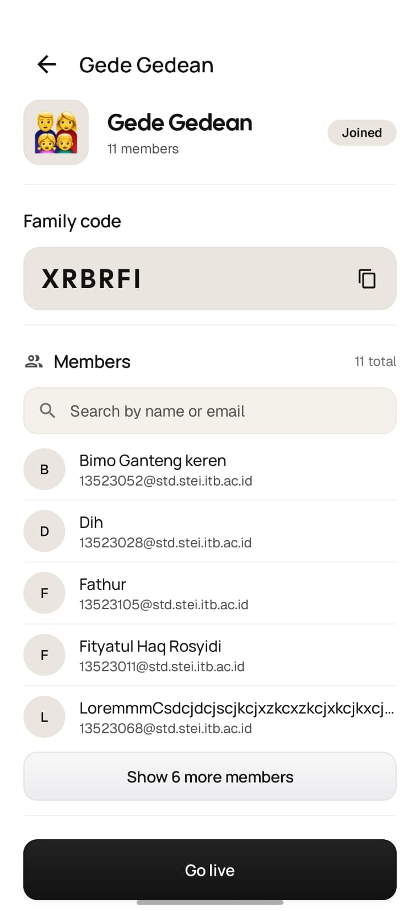
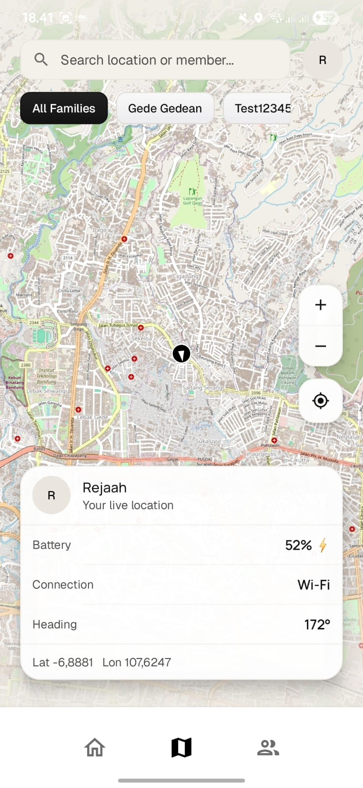
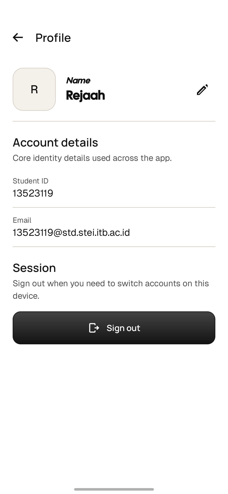

# NIMONS360

NIMONS360 adalah aplikasi Android untuk memantau lokasi dan status anggota keluarga secara real-time, mengelola keluarga, serta menyimpan lokasi favorit. Aplikasi ini mengintegrasikan REST API, WebSocket, penyimpanan lokal, GPS, dan sensor perangkat untuk mendukung pengalaman tracking yang responsif di perangkat Android.

---

## About Us

NIMONS360 dikembangkan sebagai aplikasi mobile untuk mendukung kebutuhan pemantauan keluarga secara praktis. Pengembangan aplikasi dilakukan dengan asumsi bahwa server tidak sepenuhnya aman, sehingga validasi input, konfigurasi jaringan, penyimpanan data sensitif, responsive layout, dan accessibility tetap diperhatikan di sisi client.

NIMONS360 mendukung:

- Pemantauan lokasi dan status anggota keluarga secara real-time.
- Pengelolaan family, join family, leave family, dan family code.
- Penyimpanan lokasi favorit atau marked location.
- Sinkronisasi presence menggunakan GPS, sensor perangkat, baterai, dan konektivitas.
- Integrasi REST API, WebSocket, Firebase Messaging, dan penyimpanan lokal.
- Pengalaman penggunaan yang responsif untuk portrait dan landscape.

---

## Features

NIMONS360 memiliki fitur utama berikut:

- **Authentication**: login, logout, penyimpanan session, dan pengelolaan token.
- **Home**: menampilkan daftar `My Families` dan `Discover Families`.
- **Families**: menampilkan daftar seluruh family dengan fitur search, filter, dan pin lokal.
- **Create Family**: membuat family baru dengan input nama dan pemilihan icon.
- **Family Detail**: menampilkan detail family, daftar anggota, family code, serta aksi `Join` atau `Leave`.
- **Map**: menampilkan peta interaktif, posisi pengguna, posisi anggota family lain, favorite location, filter family, kontrol zoom, dan detail member.
- **Profile**: menampilkan avatar, nama, email, edit nama, edit foto profil, dan sign out.
- **Notifications**: mendukung pesan notifikasi dan Firebase Messaging.
- **Analytics**: menampilkan statistik jarak, grafik harian, recent locations, dan export CSV.
- **Livestreaming**: mendukung mode broadcaster dan viewer untuk family tertentu.

---

## Stack

| Feature | Stack |
| --- | --- |
| Bahasa | Kotlin |
| UI | Jetpack Compose, XML Layout, Material 3 |
| Navigation | AndroidX Navigation |
| State Management | ViewModel, Lifecycle |
| Local Database | Room |
| Local Preferences | DataStore, SharedPreferences |
| Networking | Retrofit, OkHttp, WebSocket |
| Serialization | Kotlinx Serialization |
| Async Processing | Kotlin Coroutines |
| Maps | osmdroid |
| Image Loading | Coil |
| Media & Livestream | Media3, RootEncoder |
| Messaging | Firebase Messaging |
| QR Code | ZXing |
| Testing | JUnit, Turbine, AndroidX Test, Espresso |

---

## Getting Started

Bagian ini menjelaskan cara menyiapkan environment, membangun aplikasi, menjalankan unit test, dan menginstall aplikasi ke emulator atau physical device.

### Requirements

- Android Studio.
- JDK 17.
- Android SDK 35.
- Emulator atau device Android minimal API 30.
- Koneksi internet aktif.
- GPS atau location service aktif.

### Installation

1. Clone repository dan masuk ke direktori project.

```bash
git clone https://github.com/Labpro-22/ms1-k02-ege.git
cd ms1-k02-ege
```

2. Buka root project di Android Studio, lalu pastikan environment Android sesuai dengan konfigurasi project.

3. Jalankan `Gradle Sync` hingga seluruh dependency berhasil ter-resolve tanpa error.

4. Verifikasi bahwa project dapat dibangun dengan sukses melalui Gradle Wrapper.

```bash
./gradlew clean
./gradlew assembleDebug
```

5. Jika diperlukan, jalankan unit test untuk memastikan logika dasar aplikasi berjalan sesuai harapan.

```bash
./gradlew test
```

6. Hubungkan emulator atau physical device dengan Android 11 ke atas, lalu install build debug ke perangkat.

```bash
./gradlew installDebug
```

7. Alternatifnya, aplikasi dapat dijalankan langsung dari Android Studio menggunakan konfigurasi `app`.

8. Saat aplikasi pertama kali dijalankan, lakukan autentikasi menggunakan kredensial berikut:

| Field | Value |
| --- | --- |
| Email | `{NIM}@std.stei.itb.ac.id` |
| Password | `{NIM}` |

9. Berikan izin lokasi ketika diminta agar fitur peta, pelacakan posisi, dan sinkronisasi presence dapat berjalan dengan benar.

---

## Commands

```bash
./gradlew clean
./gradlew assembleDebug
./gradlew installDebug
./gradlew build
./gradlew test
```

---

## OWASP Mobile Security

Analisis dilakukan dengan asumsi server tidak sepenuhnya aman, sehingga validasi dan konfigurasi aman tetap diterapkan di sisi client.

### M4: Insufficient Input/Output Validation

#### Risiko

| No | Detail |
| --- | --- |
| 1 | Input nama profil, pesan notifikasi, kode family, dan marked location dapat kosong atau tidak sesuai format. |
| 2 | Upload foto profil dan foto marked location berisiko menerima file selain gambar atau ukuran terlalu besar. |

#### Perbaikan

| No | Detail |
| --- | --- |
| 1 | Form join family membatasi kode menjadi 6 karakter. |
| 2 | Form pesan notifikasi dan greeting tidak dapat dikirim jika pesan kosong. |
| 3 | Upload foto profil dan foto marked location hanya menerima `image/png` atau `image/jpeg`. |
| 4 | Ukuran foto dibatasi maksimal 500 KB sebelum dikirim ke API atau disimpan lokal. |
| 5 | Response API dipetakan melalui DTO/domain model dan `ignoreUnknownKeys`, sehingga field tambahan dari server tidak langsung merusak UI. |

### M8: Security Misconfiguration

#### Risiko

| No | Detail |
| --- | --- |
| 1 | Cleartext traffic global sebelumnya aktif. |
| 2 | Logging HTTP body dapat mengekspos token, data profil, pesan, dan payload multipart. |

#### Perbaikan

| No | Detail |
| --- | --- |
| 1 | `android:usesCleartextTraffic` diset `false`. |
| 2 | `network_security_config.xml` memblokir cleartext secara default. |
| 3 | Pengecualian cleartext hanya diberikan untuk `10.0.2.2` agar coordinator livestream lokal tetap bisa dipakai saat pengembangan. |
| 4 | Logging OkHttp API utama diturunkan dari `BODY` menjadi `BASIC`, sehingga request/response body sensitif tidak dicetak. |

### M9: Insecure Data Storage

#### Risiko

| No | Detail |
| --- | --- |
| 1 | Auth token tidak boleh disimpan di DataStore preferences biasa karena token adalah data sensitif. |
| 2 | Foto marked location disimpan di filesystem lokal aplikasi. |

#### Perbaikan Saat Ini

| No | Detail |
| --- | --- |
| 1 | Auth token disimpan di DataStore dalam bentuk ciphertext, bukan plaintext. |
| 2 | Enkripsi token memakai AES-256-GCM dengan secret key yang dibuat dan disimpan di Android Keystore (`AndroidKeyStore`), sehingga key tidak diekspor ke storage aplikasi. |
| 3 | Token legacy plaintext yang masih ada di DataStore dimigrasikan otomatis. Saat `SessionManager.getToken()` membaca value yang belum bisa didekripsi, value tersebut diperlakukan sebagai token lama, dienkripsi ulang, lalu disimpan kembali sebagai ciphertext. |
| 4 | Logout menghapus ciphertext token dari DataStore. |
| 5 | Foto marked location disimpan di internal app files directory, bukan public external storage. |
| 6 | Metadata marked location disimpan di Room/SQLite. |
| 7 | Saat marked location dihapus, semua path foto terkait dihapus dari filesystem melalui repository. |
| 8 | Preferensi notifikasi dan location sharing disimpan lokal memakai SharedPreferences sesuai spesifikasi. |

#### Sisa Risiko

| No | Detail |
| --- | --- |
| 1 | User name dan user id masih disimpan di DataStore biasa karena bukan credential utama. Jika kebijakan keamanan tim menganggap keduanya sensitif, pola yang sama dapat dipindahkan ke encrypted storage. |

---

## Responsive dan Accessibility

Audit responsive dilakukan untuk screen utama berikut:

- Login, Map, Family Detail, Analytics, dan Customize Pin memakai Compose dengan state input penting di `rememberSaveable` atau ViewModel.
- Home, Browse Families, Create Family, dan Profile memiliki varian `res/layout-land` agar Android memakai resource landscape eksplisit.
- Field login, create family, join family, edit profile, marked location, dan notification sheet diverifikasi tidak kehilangan nilai saat rotasi karena state transient sudah dipindahkan ke `rememberSaveable` atau ViewModel.

Perbaikan accessibility yang diterapkan:

- Tombol ikon penting memiliki `contentDescription`, termasuk back, share, QR, notification, dan profile-photo edit.
- Target interaksi utama memakai tinggi tombol 48-52dp atau icon button 40-48dp sesuai token touch target.
- Warna aksi tetap mengikuti sistem final: primary charcoal, surface putih, red hanya destructive, dan text secondary tidak dipakai untuk tindakan utama.
- Before: beberapa aksi bonus belum memiliki jalur akses eksplisit di Profile/Family Detail/Map.
- After: Analytics, Customize Pin, QR share, dan map screenshot share tersedia sebagai tombol/aksi bernama dan dapat ditemukan dari alur utama.

### Accessibility Scanner Evidence

Accessibility Scanner perlu dijalankan setelah fitur milestone selesai pada screen Login, Home, Families, Create Family, Family Detail, Map, Profile, Analytics, dan Customize Pin.

Ringkasan suggestion sebelum perbaikan:

- Beberapa tombol ikon belum memiliki label yang cukup jelas.
- Beberapa target sentuh aksi bonus terlalu bergantung pada ikon tanpa teks.
- Beberapa aksi baru belum dapat ditemukan dari halaman utama Profile atau Family Detail.

Perbaikan yang diterapkan:

- Menambahkan `contentDescription` pada ikon back, share, QR, notification, profile-photo edit, dan action penting lain.
- Menggunakan tombol teks untuk aksi baru yang bukan ikon familiar, seperti `Export CSV`, `Download pin`, `Share downloaded pin`, dan `Share QR code`.
- Memastikan tombol utama menggunakan tinggi 48-52dp dan icon button 40-48dp sesuai minimum touch target.
- Mempertahankan kontras warna final design system: teks utama charcoal di atas surface putih, primary action charcoal, dan destructive action merah hanya untuk aksi destructive.

---

## Bonus Features

- Instagram Story map screenshot sharing tersedia dari panel lokasi di Map melalui aksi `Share story`.
- Analytics tersedia dari Profile, menampilkan monthly distance average, total distance, daily distance average, active days, daily distance graph per month, recent locations, dan export CSV berisi analytics serta location history.
- QR-code family sharing tersedia dari Family Detail untuk member family yang memiliki code.
- Custom pin download tersedia dari Profile melalui foreground service dengan progress notification.

---

## Firebase Configuration

Firebase Messaging dependency dan Google Services plugin sudah disiapkan. Plugin `com.google.gms.google-services` hanya diterapkan ketika file asli `app/google-services.json` tersedia, sehingga build lokal tetap berhasil tanpa konfigurasi rahasia.

Letakkan file Firebase yang diberikan di:

```text
app/google-services.json
```

sebelum menjalankan push notification end-to-end.

---

## Screenshot

### Splash

- Menampilkan splash screen saat aplikasi dibuka sebagai transisi awal ke login atau home.



### Login

- Menampilkan form autentikasi dengan input email dan password.
- Setelah login berhasil, pengguna diarahkan ke halaman `Home`.


### Home

- Menampilkan daftar `My Families` dan `Discover Families`.
- Terdapat avatar menuju `Profile` dan tombol `+` menuju `Create Family`.



### Families

- Menampilkan daftar seluruh family dengan fitur search, filter, dan pin lokal.
- Terdapat akses ke `Profile` dan `Create Family`.



### Create Family

- Menampilkan form pembuatan family dengan input nama dan pemilihan icon.
- Setelah berhasil dibuat, pengguna diarahkan ke halaman detail family.



### Family Detail

- Menampilkan detail family, daftar anggota, family code, serta aksi `Join` atau `Leave`.
- Family code dapat disalin jika pengguna sudah tergabung dalam family.



### Map

- Menampilkan peta interaktif, posisi pengguna, posisi anggota family lain, dan favorite location.
- Tersedia filter family, kontrol zoom, detail member, dan integrasi lokasi realtime.



### Profile

- Menampilkan avatar, nama, email, serta fitur edit nama dan sign out.



---

## Pembagian Kerja

| Anggota | NIM | Tugas |
| --- | --- | --- |
| Muhammad Fathur Rizky | 13523105 | Auth, Login, Logout, Profile, Open API, Livestreaming |
| Reza Ahmad Syarif | 13523119 | Home, Map, Network Sensing |
| Ahmad Wicaksono | 13523121 | Families, Create Family, Detail Families |

---

## Jam Persiapan dan Pengerjaan

| Anggota | Jam Persiapan | Jam Pengerjaan |
| --- | ---: | ---: |
| Muhammad Fathur Rizky | 10 jam | 46 jam |
| Reza Ahmad Syarif | 12 jam | 51 jam |
| Ahmad Wicaksono | 8 jam | 43 jam |
